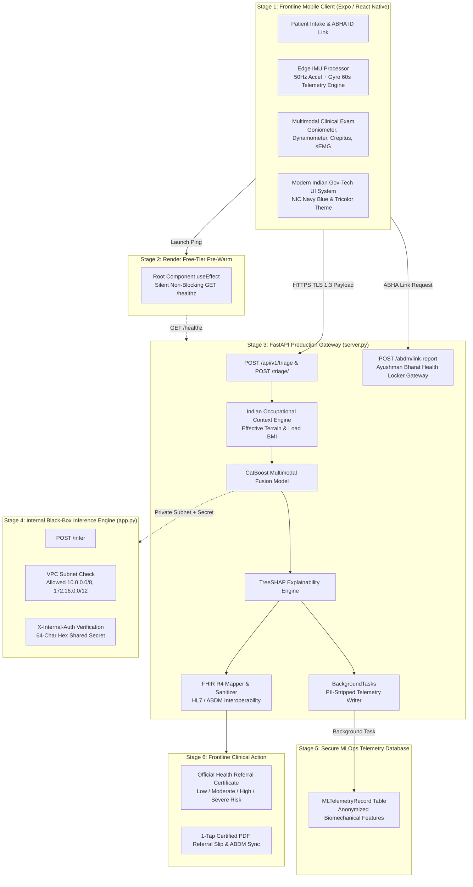

# Kneeva (OA-NER) — Non-Invasive Multimodal Knee Osteoarthritis Screening Platform

[](https://expo.dev/)
[](src/styles/theme.ts)
[](https://fastapi.tiangolo.com/)
[](https://kneeva-api.onrender.com)
[](LICENSE)

> **Kneeva** is an edge-first, multimodal clinical screening, risk stratification, and MLOps telemetry platform for **Knee Osteoarthritis (KOA)**. Engineered specifically for frontline Accredited Social Health Activists (**ASHA workers**), Auxiliary Nurse Midwives (**ANMs**), and Primary Health Centers (**PHCs**), Kneeva enables early non-invasive detection of osteoarthritis before irreversible cartilage loss occurs on X-rays.

---

## 📌 Executive Summary

### The Clinical & Operational Challenge
- **Late Diagnostic Gap:** Standard Knee OA diagnosis relies on radiological joint space narrowing (Kellgren-Lawrence grading) on X-rays or MRIs. By the time structural joint degradation appears on radiographs, articular cartilage damage is irreversible.
- **Rural Primary Healthcare Isolation:** Primary Health Centers (PHCs) in high-altitude, rural, and remote regions lack radiologists and radiographic equipment.
- **ABDM & Health Registry Silos:** Traditional point-of-care tools fail to link patient triage directly to the **Ayushman Bharat Digital Mission (ABDM)** or **Ayushman Bharat Health Account (ABHA)** registry.

### Kneeva's Integrated Solution
Kneeva combines **on-device edge signal processing**, **multimodal biomechanical sensor fusion**, **CatBoost machine learning**, **TreeSHAP explainability**, **Modern Indian Government (NIC Gov-Tech) UX**, and **ABDM / FHIR R4 interoperability**:

1. **Modern Indian Government (NIC Gov-Tech) Design System:** Tailored UI styled after official NIC apps (UMANG, DigiLocker, CoWIN) featuring **NIC Navy Blue (`#003366`)**, **Tricolor Saffron (`#FF9933`)**, **India Green (`#138808`)**, paper-like government document backgrounds (`#F4F4F0`), high-contrast outdoor-legible typography, and official health referral certificate displays.
2. **On-Device Edge IMU Signal Processor:** Operates directly inside the mobile client ([src/services/imuProcessor.ts](src/services/imuProcessor.ts)), running real-time 50Hz gait sampling, 60-second slow walk & fast walk telemetry, peak detection, cadence computation, stride time variability ($CV$), and step asymmetry.
3. **Multimodal Biomechanical Sensor Ingestion:** Fuses gait dynamics with isometric dynamometer strength ratios ($H:Q$, Quad-to-Bodyweight), wireless digital goniometer range-of-motion (ROM flexion/extension deficit), acoustic vibroarthrographic crepitus joint sound sensors, and sEMG bio-patch co-contraction indices.
4. **Indian Occupational Context & Effective Terrain BMI:** Calculates terrain-adjusted effective BMI factoring in daily high-altitude carried loads (water vessels, headloads, firewood) and steep mountain incline hours.
5. **ABDM / ABHA Digital Health Integration:** Directly links patient triage sessions and forwards referral reports to the **Ayushman Bharat Health Account (ABHA)** health locker via ABDM endpoints (`/abdm/verify-abha`, `/abdm/link-report`).
6. **Anonymized Data Flywheel (MLOps Telemetry):** Asynchronously writes PII-stripped feature payloads (`tier_a`, `tier_b`, `tier_c`, `risk_score`) to the `MLTelemetryRecord` table via FastAPI `BackgroundTasks` for continuous model retraining without storing patient names or ABHA IDs.
7. **Multi-Layer Security Architecture:** Transmits data via TLS 1.3, enforces private VPC subnet restrictions (`10.0.0.0/8`, `172.16.0.0/12`) and 64-character hex shared secret authentication (`X-Internal-Auth`) on internal inference microservices (`app.py`), and scrubs internal model weights before outputting ABDM-compliant FHIR R4 DiagnosticReports.
8. **1-Tap Certified PDF Referral Slip:** Generates official diagnostic referral slips via `expo-print` and native device share sheets (`expo-sharing`).

---

## 🎨 Modern Indian Government (Gov-Tech) UI/UX

Kneeva features a specialized design system engineered for high-visibility outdoor usage by ASHA workers in remote terrain:

| Token | Color Code | Application |
| :--- | :--- | :--- |
| **NIC Navy Blue** | `#003366` | Top navigation header bars, official emblem banners, primary headers, modal titles |
| **India Green** | `#138808` | Primary action buttons ("Start Triage", "Run Test"), ABDM sync badges, low risk badges |
| **Saffron Accent** | `#FF9933` | Active step indicators, warning highlights, sub-test toggles, moderate risk badges |
| **Paper Surface** | `#F4F4F0` | Main application background (classic paper government document feel) |
| **Crisp White Card** | `#FFFFFF` | Solid elevated cards with `#B0BEC5` 1px borders & 4px-8px sharp corner rounding |
| **High-Contrast Text** | `#003366` / `#0F172A` | Bold, uppercase input labels and high-legibility outdoor typography |

---

## 🏗️ System Architecture



---

## 🔒 Security & Privacy Architecture

| Security Boundary | Mechanism | Description |
| :--- | :--- | :--- |
| **App to Gateway** | TLS 1.3 | All mobile client communication connects to `https://kneeva-api.onrender.com` over HTTPS, securing traffic over public rural Wi-Fi. |
| **Gateway to ABDM** | ABDM Gateway & AES-256-GCM | Encrypts ABHA patient diagnostic payloads before transmitting to the national health registry locker (`/abdm/link-report`). |
| **FHIR Sanitization** | `sanitize_clinical_narrative` | Scrubs internal model weights, Platt scaling constants, and raw debug symbols from FHIR bundle notes. |
| **Gateway to Inference** | Black-Box VPC Isolation | `app.py` enforces VPC IP subnet checking (`10.0.0.0/8`, `172.16.0.0/12`) and `X-Internal-Auth` 64-character hex shared secret headers. |
| **Data Flywheel** | Anonymized `MLTelemetryRecord` | `BackgroundTasks` strips `patient_id` and `abha_number` before persisting raw features to `ml_telemetry` for CatBoost retraining. |

---

## ⚡ Edge Signal Processing & Math Formulas

To prevent Python server latency during field screenings, real-time gait feature extraction occurs on-device inside `imuProcessor.ts`:

$$\text{Cadence (steps/min)} = \frac{\text{Total Heel-Strike Peaks}}{\text{Duration (minutes)}}$$

$$\text{Stride Time CV} = \frac{\sigma(\Delta t_{\text{steps}})}{\mu(\Delta t_{\text{steps}})}$$

$$\text{Step Time Asymmetry} = \frac{|\mu_{\text{even steps}} - \mu_{\text{odd steps}}|}{\mu_{\text{all steps}}}$$

$$\text{Effective Terrain BMI} = \text{BMI}_{\text{standard}} + 0.18 \times \text{Carried Load (kg)}$$

---

## 📊 API Contract Schemas

### 1. Request Payload: `POST /api/v1/triage` (or `POST /triage/`)
```json
{
  "patient_id": "PT-10045",
  "abha_number": "91-4521-8890-3412",
  "tier_a": {
    "age": 58,
    "sex": "female",
    "height_cm": 156.0,
    "weight_kg": 64.0,
    "daily_load_kg": 15.0,
    "daily_incline_hours": 2.5,
    "squatting_difficulty": 3,
    "previous_injury": 0,
    "activity_level": 3
  },
  "tier_b": {
    "flat_gait_cadence": 88.5,
    "flat_gait_stride_time_cv": 0.092,
    "climbing_cadence": 76.0,
    "climbing_stride_time_cv": 0.14,
    "gait_step_time_asymmetry": 0.16,
    "strength_ext_peak_n": 185.0,
    "strength_flex_peak_n": 115.0,
    "strength_ext_bw_ratio": 2.89,
    "rom_active_flexion_deg": 114.0,
    "crepitus_event_count": 12.0,
    "crepitus_presence": 1.0
  }
}
```

### 2. Triage Response Payload
```json
{
  "patient_id": "PT-10045",
  "abha_id": "91-4521-8890-3412",
  "oa_risk_score": 0.825,
  "oa_risk_category": "high",
  "urgency": "Urgent",
  "confidence_interval": [0.75, 0.89],
  "effective_bmi": 29.0,
  "feature_importance": {
    "flat_gait_stride_time_cv": 0.15,
    "climbing_cadence": 0.12,
    "rom_flexion_deficit_deg": 0.11,
    "carried_load_kg": 0.09,
    "effective_bmi": 0.08
  },
  "clinical_explanation": "Patient demonstrates significantly elevated risk (82.5%). Primary drivers are high flat stride variability and slow climbing cadence.",
  "clinical_action": "Refer to orthopedic specialist for immediate X-ray and conservative management.",
  "missing_modality_count": 0,
  "fhir_bundle": {
    "resourceType": "Bundle",
    "type": "document"
  }
}
```

### 3. ABDM Health Locker Sync Payload: `POST /abdm/link-report`
```json
{
  "patient_id": "PT-10045",
  "abha_id": "91-4521-8890-3412",
  "triage_result": {
    "oa_risk_score": 0.825,
    "oa_risk_category": "high"
  }
}
```

---

## 📁 Repository Structure

```plaintext
oa-ner-app/
├── backend/
│   ├── app.py                       # Black-Box Inference Microservice (VPC Subnet & X-Internal-Auth)
│   ├── main.py                      # FastAPI App Entry & UDP Session Manager
│   ├── database.py                  # Patient SQLite Database Setup
│   ├── test_server_triage.py        # Automated Pytest Suite (3/3 Passing)
│   ├── requirements.txt             # Backend dependencies (FastAPI, SQLAlchemy, CatBoost, SHAP, Pytest)
│   └── src/
│       ├── server.py                # Production FastAPI Gateway, ABDM Endpoints & MLOps Flywheel
│       ├── features/
│       │   └── tier_c.py            # Indian Context & Effective Terrain-Adjusted BMI
│       ├── fhir/
│       │   └── fhir_mapper.py       # FHIR R4 Bundle Mapper & Payload Sanitizer
│       ├── models/
│       │   ├── fusion.py            # CatBoost Multimodal Fusion Model
│       │   └── explainability.py    # TreeSHAP Feature Attribution Engine
│       └── security/
│           └── abdm_gateway.py      # ABDM / ABHA Verification Gateway
│
├── src/
│   ├── app/                         # Expo Router File-Based Navigation
│   │   ├── _layout.tsx              # Root Layout & Render Pre-Warm Heartbeat Hook
│   │   ├── dashboard.tsx            # ASHA Worker Dashboard (NIC Gov-Tech Aesthetic)
│   │   ├── index.tsx                # Security PIN Authentication Screen
│   │   ├── patient/
│   │   │   └── [id].tsx             # Patient Profile & Full Triage Intake Form
│   │   ├── report/
│   │   │   └── [sessionId].tsx      # Detailed Diagnostic Insights & Model Contribution Breakdown
│   │   └── kneeva/
│   │       ├── index.tsx            # Multi-Step Triage Wizard (Demographics, Sensors, 60s IMU Walk)
│   │       └── results.tsx          # Official Health Referral Certificate & 1-Tap PDF Share
│   ├── components/                  # UI Components (BodyMap, PainSlider, StepIndicator, WaveformDisplay)
│   ├── services/
│   │   ├── imuProcessor.ts          # Edge IMU Signal Processor & Dual Gait Telemetry Engine
│   │   ├── kneevaService.ts         # Cloud Gateway Connector (https://kneeva-api.onrender.com)
│   │   └── patientService.ts        # Local Patient Record Storage
│   ├── styles/
│   │   └── theme.ts                 # Modern Indian Government (NIC Gov-Tech) Design Tokens
│   └── types/
│       └── kneeva.ts                # TypeScript Integration Contracts
│
├── package.json                     # React Native & Expo Dependencies
└── README.md                        # Platform Documentation & Architecture Guide
```

---

## 🚀 Quickstart Guide

### 1. Backend Setup & Automated Test Suite
```bash
# Navigate to backend directory
cd backend

# Install Python dependencies
pip install -r requirements.txt

# Run automated backend test suite (pytest)
python -m pytest test_server_triage.py

# Launch FastAPI production gateway (Port 8000)
uvicorn src.server:app --host 0.0.0.0 --port 8000 --reload

# Launch black-box inference engine (Port 8001)
uvicorn app:app --host 0.0.0.0 --port 8001 --reload
```

### 2. Frontend Setup & Verification
```bash
# Install Node dependencies
npm install

# Run TypeScript type verification
npx tsc --noEmit

# Start Expo development server
npx expo start
```
- Press `a` to run in Android Emulator.
- Scan QR code using **Expo Go** on Android/iOS physical device.
- Press `w` for Web preview.

---

## 👥 Acknowledgements & SIH Guidelines
- **Project Kneeva** — Engineered for Smart India Hackathon (SIH) Knee Osteoarthritis Screening Challenge.
- Built with ❤️ using Expo, React Native, FastAPI, CatBoost, TreeSHAP, HL7 FHIR R4, and NIC Gov-Tech UI/UX standards.
