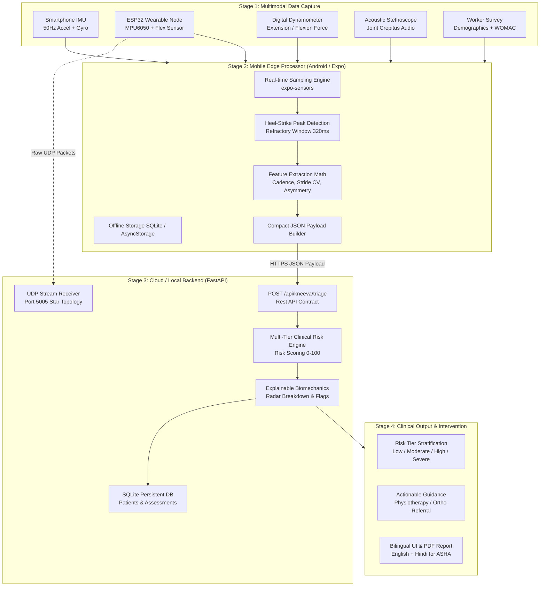

# Kneeva (OA-NER) — Non-Invasive Knee Osteoarthritis Early Screening Platform

[](https://expo.dev/)
[](https://fastapi.tiangolo.com/)
[](https://www.espressif.com/)
[](LICENSE)

> **Kneeva** is an edge-first, multimodal clinical screening and risk stratification platform for **Knee Osteoarthritis (KOA)**. Built for frontline healthcare workers (ASHA/ANM workers, community health centers, and physiotherapists), Kneeva enables early non-invasive detection before irreversible cartilage loss occurs on X-rays.

---

## 📌 Executive Summary

### The Clinical Problem
- **Late Detection Dilemma:** Standard diagnosis relies on radiological joint space narrowing (Kellgren-Lawrence grading) on X-rays or MRIs. By the time symptoms appear on radiographs, articular cartilage degradation is irreversible.
- **Rural Diagnostic Gap:** Rural primary health centers (PHCs) lack trained radiologists and radiographic equipment.
- **Subjective Screening:** Traditional questionnaires (WOMAC, KOOS) rely on patient recall and lack objective biomechanical biomarkers.

### Kneeva's Solution
Kneeva combines **on-device edge signal processing**, **multimodal biomechanical sensors**, and a **clinical triage risk engine**:
1. **Edge IMU Processing:** Uses mobile phone sensors (`expo-sensors`) or wireless wearable sensor nodes (ESP32 + MPU-6050) to run real-time peak-detection gait analysis (cadence, stride time variability, asymmetry).
2. **Multimodal Sensor Fusion:** Ingests dynamic gait biomechanics, digital dynamometer strength ratios ($H:Q$, Quad-to-Bodyweight), goniometer range-of-motion (ROM flexion/extension deficit), and vibroacoustic crepitus sounds.
3. **Clinical Triage Engine:** Stratifies patients into 4 risk tiers (**Low, Moderate, High, Severe**) with actionable, explainable clinical recommendations and local referrals.
4. **ASHA-Friendly UI:** Bilingual (English & Hindi), offline-first storage, PIN authentication, and visual pain mapping.

---

## 🏗️ System Architecture



---

## ⚡ Edge Processing vs. Cloud: Why No Heavy Python Libraries?

In earlier research phases, offline Python scripts relied on heavy audio/gait libraries (`gaitpy`, `librosa`) that suffered from severe dependency deadlocks (e.g. `gaitpy` requiring legacy `pandas==0.20.3`).

**Kneeva eliminates this entirely by adopting Edge Computing:**
- **On-Device Signal Processing:** Feature extraction runs directly inside the client application ([src/services/imuProcessor.ts](src/services/imuProcessor.ts)) in real-time.
- **Zero Heavy Cloud DSP:** The cloud server does not need to parse gigabytes of raw time-series CSVs. It only receives clean, validated numerical features.
- **Bandwidth Efficient:** Instead of streaming 50 MB of raw audio and IMU buffers, the mobile app sends a `< 2 KB` JSON payload.
- **Offline Resilient:** Community health workers can perform screenings in remote villages without internet connectivity, storing results locally and syncing when back online.

### Edge Mathematical Formulas

$$\text{Cadence (steps/min)} = \frac{\text{Total Peaks Detected}}{\text{Duration in Minutes}}$$

$$\text{Stride Time CV (Variability)} = \frac{\sigma(\Delta t_{\text{steps}})}{\mu(\Delta t_{\text{steps}})}$$

$$\text{Step Time Asymmetry} = \frac{|\mu_{\text{even steps}} - \mu_{\text{odd steps}}|}{\mu_{\text{all steps}}}$$

$$\text{Gait Speed (m/s)} \approx \frac{\text{Cadence} \times \text{Step Length (0.58m)}}{60}$$

---

## 📊 API Contracts & Payload Schemas

### 1. Triage Assessment Request: `POST /api/kneeva/triage`

```json
{
  "patient": {
    "age": 58,
    "sex": "female",
    "height_cm": 158.0,
    "weight_kg": 68.0
  },
  "questionnaire": {
    "carried_load_kg": 15.0,
    "daily_incline_hours": 3.0,
    "squatting_difficulty": 3,
    "previous_injury": 0,
    "activity_level": 2
  },
  "sensors": {
    "flat_gait_cadence": 88.5,
    "flat_gait_stride_time_cv": 0.092,
    "climbing_cadence": 76.0,
    "climbing_stride_time_cv": 0.145,
    "gait_step_time_asymmetry": 0.18,
    "gait_speed_ms": 0.85,
    "strength_ext_peak_n": 180.0,
    "strength_flex_peak_n": 110.0,
    "strength_ext_bw_ratio": 2.65,
    "strength_hq_ratio": 0.61,
    "rom_active_flexion_deg": 112.0,
    "rom_active_extension_deficit_deg": 8.0,
    "crepitus_event_count": 14,
    "crepitus_total_energy": 2800.0,
    "crepitus_presence": 1.0
  }
}
```

### 2. Triage Assessment Response

```json
{
  "risk_score": 74.2,
  "risk_level": "High",
  "urgency": "Urgent",
  "confidence": 0.89,
  "primary_drivers": [
    "Elevated stride time variability (CV = 0.092)",
    "Severe quad extension weakness (BW ratio = 2.65)",
    "Significant acoustic crepitus detected (14 events)",
    "Active flexion deficit (>15 deg limitation)"
  ],
  "recommendations": [
    "Immediate referral to secondary orthopedic center for bilateral radiograph",
    "Prescribe non-weight-bearing isometric quadriceps strengthening",
    "Provide unloader knee brace consultation"
  ],
  "radar_breakdown": {
    "gait_stability": 42.0,
    "muscle_strength": 38.0,
    "range_of_motion": 65.0,
    "joint_acoustics": 30.0,
    "lifestyle_load": 45.0
  }
}
```

---

## 📁 Repository Structure

```plaintext
oa-ner-app/
├── backend/
│   ├── firmware/
│   │   └── oa_ner_sensor/
│   │       └── oa_ner_sensor.ino     # ESP32 C++ firmware (MPU6050 + Flex sensor over UDP)
│   ├── ble_manager.py                # Bluetooth Low Energy peripheral manager
│   ├── database.py                   # SQLite storage & patient record schema
│   ├── main.py                       # FastAPI application & REST routing
│   ├── risk_engine.py                # Multi-tier clinical OA risk scoring algorithm
│   ├── schemas.py                    # Pydantic data models & API contracts
│   ├── security.py                   # SHA-256 PIN authentication for frontline workers
│   ├── test_backend.py               # Automated pytest suite (8/8 unit tests)
│   ├── udp_manager.py                # UDP socket receiver (port 5005)
│   └── requirements.txt              # FastAPI, uvicorn, pydantic, pytest, httpx
│
├── src/
│   ├── app/                          # Expo Router file-based screens
│   │   ├── _layout.tsx               # Root layout & theme providers
│   │   ├── dashboard.tsx             # Worker dashboard & recent screenings
│   │   ├── index.tsx                 # PIN login screen
│   │   ├── kneeva/
│   │   │   ├── index.tsx             # Multimodal assessment intake flow (5 steps)
│   │   │   └── results.tsx           # Triage output screen with radar charts & referral
│   │   └── patient/                  # Patient registry & history views
│   │
│   ├── components/                   # Reusable UI elements (Glassmorphic cards, buttons)
│   ├── context/                      # React state contexts (Auth, Assessment state)
│   ├── i18n/                         # Internationalization (English & Hindi)
│   ├── services/
│   │   ├── authService.ts            # Worker PIN verification service
│   │   ├── bleService.ts             # BLE scanner & sensor streaming
│   │   ├── imuProcessor.ts           # On-device Edge IMU signal processor & peak detector
│   │   ├── kneevaService.ts          # API connector to /api/kneeva/triage
│   │   └── patientService.ts         # Patient CRUD operations
│   └── types/
│       └── kneeva.ts                 # TypeScript interfaces for Kneeva contracts
│
├── app.json                          # Expo configuration
├── package.json                      # React Native & Expo dependencies
├── requirements.txt                  # Workspace-level Python requirements
└── tsconfig.json                     # TypeScript strict configuration
```

---

## 🚀 Setup & Execution Guide

### Prerequisites
- **Node.js**: v18+ & npm
- **Python**: v3.10+ (Tested on Python 3.13)
- **Expo Go App** (on Android/iOS device) or Android Studio Emulator

---

### Step 1: Run the Python Backend

1. **Activate the Virtual Environment:**
   - **PowerShell (Windows):**
     ```powershell
     .\.venv\Scripts\Activate.ps1
     ```
   - **macOS / Linux:**
     ```bash
     source .venv/bin/activate
     ```

2. **Install Dependencies:**
   ```bash
   pip install -r requirements.txt
   ```

3. **Run Unit Tests:**
   ```bash
   pytest backend/test_backend.py
   ```

4. **Start the FastAPI Server:**
   ```bash
   cd backend
   uvicorn main:app --host 0.0.0.0 --port 8000 --reload
   ```
   * Interactive API Documentation: `http://localhost:8000/docs`
   * Health Check: `http://localhost:8000/api/health`

---

### Step 2: Run the Mobile Application (Expo)

1. **Install Node Dependencies:**
   ```bash
   npm install
   ```

2. **Start the Expo Development Server:**
   ```bash
   npx expo start
   ```

3. **Launch on Device or Emulator:**
   - Press `a` for Android Emulator.
   - Scan the terminal QR code with **Expo Go** on your physical Android/iOS phone.
   - Press `w` to preview on Web.

---

### Step 3: Hardware Firmware (Optional)
If connecting the custom ESP32 physical sensor:
1. Open [backend/firmware/oa_ner_sensor/oa_ner_sensor.ino](backend/firmware/oa_ner_sensor/oa_ner_sensor.ino) in Arduino IDE.
2. Install `ArduinoJson` (v6+) and `Adafruit_MPU6050`.
3. Set your Wi-Fi SSID, Password, and your computer's local IP address (`backendIP`).
4. Flash the code to the ESP32 via USB.
5. The ESP32 will immediately stream UDP telemetry to your server on port `5005`.

---

## 💡 Gemini Brainstorming & Co-Pilot Prompts

Upload this `README.md` to **Google Gemini** along with any of the following prompts to get instant architectural, clinical, and algorithmic assistance:

### Prompt 1: Enhancing the Edge Gait Algorithm
> *"Based on the attached Kneeva README, review the edge peak-detection algorithm in `imuProcessor.ts`. How can I add dynamic thresholding (moving average window) to handle varying walking speeds and reduce false heel strikes in elderly rural patients?"*

### Prompt 2: Refining the Multimodal Risk Engine
> *"Refer to the 4-tier clinical risk engine described in the README. How can I formulate a Bayesian or logistic regression weighting model combining the IMU cadence, Quad-to-BW strength ratio, and crepitus acoustic energy to output validated Kellgren-Lawrence grade probabilities (KL 0 to 4)?"*

### Prompt 3: ASHA Worker Usability & Offline Synchronization
> *"I am building Kneeva for Indian community health workers (ASHA/ANM). Based on the architecture in the README, how should I design an offline-first SQLite sync queue in React Native that stores screenings locally in rural areas and uploads them automatically when Wi-Fi/4G is restored?"*

### Prompt 4: Pitch Deck & Hackathon Judging Strategy
> *"Review the clinical problem and edge-processing architecture in this README. Generate a compelling 3-minute hackathon pitch script highlighting why our edge-first approach beats traditional cloud-heavy AI for rural health screening."*

---

## 👥 Contributors & Acknowledgements
- **Project Kneeva** — Developed for Smart India Hackathon (SIH) Knee Osteoarthritis Screening Challenge.
- Built with ❤️ using Expo, React Native, FastAPI, and ESP32.
