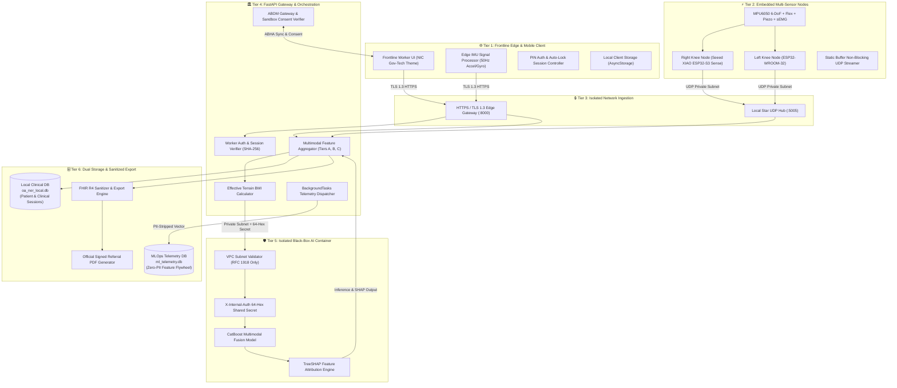
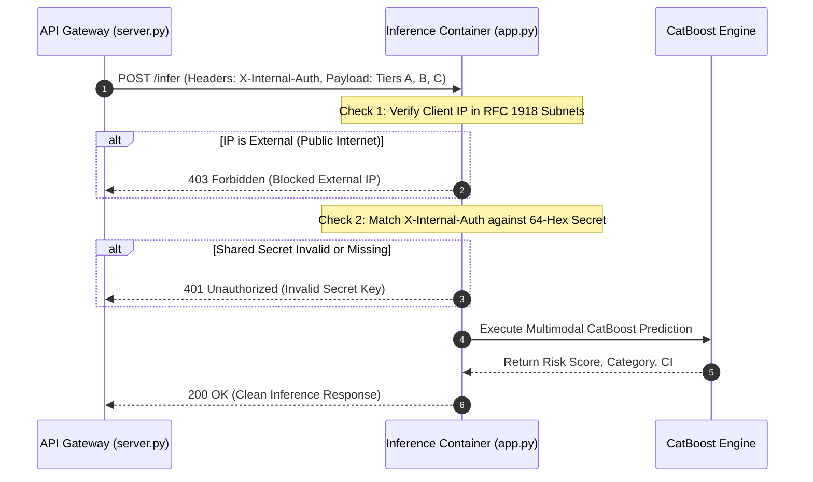

# 🛡️ Kneeva (OA-NER) — Comprehensive Tech Stack & In-Depth Security Architecture

> **Document Version:** 2.0.0  
> **Target Audience:** System Architects, Security Auditors, Healthcare IT Officers, Clinical ML Engineers, and Developers  
> **Platform Classification:** Edge-First Non-Invasive Multimodal Knee Osteoarthritis (KOA) Screening & MLOps Telemetry Platform

---

## 📑 Table of Contents

1. [System Overview & Architecture](#1-system-overview--architecture)
2. [Complete Technology Stack](#2-complete-technology-stack)
   - [2.1 Frontend & Mobile Edge Client](#21-frontend--mobile-edge-client)
   - [2.2 Backend Services & API Gateway](#22-backend-services--api-gateway)
   - [2.3 Machine Learning & Explainable AI (XAI)](#23-machine-learning--explainable-ai-xai)
   - [2.4 Hardware, Sensors & Embedded Firmware](#24-hardware-sensors--embedded-firmware)
   - [2.5 Healthcare Standards & ABDM Interoperability](#25-healthcare-standards--abdm-interoperability)
   - [2.6 Database & MLOps Telemetry Storage](#26-database--mlops-telemetry-storage)
3. [Deep-Dive Security Architecture](#3-deep-dive-security-architecture)
   - [3.1 Security Level Rating & Defense-in-Depth Model](#31-security-level-rating--defense-in-depth-model)
   - [3.2 Tier 1: Frontline Client & Health Worker Authentication](#32-tier-1-frontline-client--health-worker-authentication)
   - [3.3 Tier 2: Embedded IoT & Hardware Sensor Security](#33-tier-2-embedded-iot--hardware-sensor-security)
   - [3.4 Tier 3: Network & Transport Layer Security](#34-tier-3-network--transport-layer-security)
   - [3.5 Tier 4: Microservice Perimeter & Black-Box Defense](#35-tier-4-microservice-perimeter--black-box-defense)
   - [3.6 Tier 5: Privacy, De-Identification & Data-at-Rest Security](#36-tier-5-privacy-de-identification--data-at-rest-security)
   - [3.7 Tier 6: FHIR R4 Sanitization & ABDM Consent Gateway](#37-tier-6-fhir-r4-sanitization--abdm-consent-gateway)
4. [Threat Matrix & Mitigations (STRIDE / OWASP Top 10)](#4-threat-matrix--mitigations-stride--owasp-top-10)
5. [Security Checklist & Production Hardening](#5-security-checklist--production-hardening)

---

## 1. System Overview & Architecture

Kneeva (OA-NER) is an enterprise-grade medical screening ecosystem designed for frontline health workers (ASHAs, ANMs) in low-resource and high-altitude terrains. It delivers non-invasive knee osteoarthritis risk stratification before radiological joint space narrowing occurs on X-rays.



---

## 2. Complete Technology Stack

### 2.1 Frontend & Mobile Edge Client

The frontline mobile client is engineered for high performance, offline tolerance, and low latency in remote field settings.

| Component | Technology | Version | Purpose & Implementation Details |
| :--- | :--- | :--- | :--- |
| **Mobile Core** | React Native | `0.86.3` | Native cross-platform runtime for Android and iOS devices. |
| **App Framework** | Expo SDK | `~57.0.21` | Managed tooling, native module integration, and compilation pipeline. |
| **Navigation** | Expo Router | `~57.0.20` | File-based type-safe routing supporting nested clinical workflows. |
| **Language** | TypeScript | `~6.0.3` | Strict static typing across all payloads, state interfaces, and API contracts. |
| **Animations** | React Native Reanimated | `4.5.1` | 60/120 FPS hardware-accelerated animations for real-time sensor graphs. |
| **Gesture Control**| React Native Gesture Handler | `~2.32.0` | Native gesture primitives for interactive joint range-of-motion assessments. |
| **Edge Sensors** | Expo Sensors | `~57.0.3` | Direct on-device Accelerometer and Gyroscope sampling at 50Hz. |
| **Signal Engine** | `imuProcessor.ts` | Custom | On-device Butterworth/Biquad filtering, peak detection, cadence ($SPM$), stride CV ($CV_{stride}$), and step asymmetry computation. |
| **Local Cache** | AsyncStorage | `2.2.0` | Local persistent caching of offline records and state. |
| **PDF Generation**| `expo-print` & `expo-sharing` | `~57.0.2` | Client-side generation and sharing of official certified clinical referral slips. |
| **Design System** | NIC Gov-Tech UI | Custom | Custom design system based on Indian National Informatics Centre (NIC) guidelines (`#003366` Navy, `#138808` India Green, `#FF9933` Saffron). |

---

### 2.2 Backend Services & API Gateway

The backend is built with asynchronous Python microservices configured for high concurrency, validation safety, and container isolation.

| Component | Technology | Version | Purpose & Implementation Details |
| :--- | :--- | :--- | :--- |
| **API Framework**| FastAPI | `>=0.110.0` | High-performance async ASGI web framework for REST and WebSocket interfaces. |
| **ASGI Server** | Uvicorn (Standard) | `>=0.28.0` | Lightning-fast async event loop with uvloop and httptools. |
| **Data Validation**| Pydantic v2 | `>=2.0.0` | Compile-time and runtime schema parsing, coercion, and strict sanitization. |
| **UDP Hub** | Asyncio Datagram Socket | Native | High-throughput Star Topology UDP ingestion hub running on port 5005. |
| **HTTP Client** | HTTPX | `>=0.27.0` | Async HTTP client for inter-service communication and ABDM calls. |
| **Observability** | Prometheus Instrumentator | `>=7.0.0` | Real-time endpoint latency, error rates, and request count telemetry. |
| **Error Tracking**| Sentry SDK | `>=2.0.0` | Crash reporting, real-time alerting, and performance tracing. |

---

### 2.3 Machine Learning & Explainable AI (XAI)

The clinical decision support engine utilizes gradient boosted trees tailored for multimodal biological and biomechanical datasets with missing features.

| Layer | Technology | Function |
| :--- | :--- | :--- |
| **Core Model** | **CatBoostClassifier** (`v1.2+`) | Gradient boosted decision trees trained on multimodal tabular and kinematic features. Handles categorical features natively with low overfitting risk. |
| **Feature Fusion** | **Tri-Tier Modality Fusion** | **Tier A:** Demographics (Age, Gender, WOMAC, Squatting difficulty).<br>**Tier B:** Biomechanical sensors (IMU flat/climbing CV, Dynamometer $H:Q$ ratio, Goniometer ROM deficit, Piezo acoustic crepitus count, sEMG co-contraction index).<br>**Tier C:** Indian Context (Terrain incline hours, daily carried headloads, Terrain-Adjusted Effective BMI). |
| **Missing Modality Handling** | **Dynamic Masking & Imputation** | Gracefully handles missing sensor nodes ($N \in [0..5]$) without crashing or hallucinating, penalizing confidence interval width accordingly. |
| **Explainability (XAI)** | **TreeSHAP Engine** | Computes local Shapley additive explanations for every inference call, outputting normalized feature importance and clinical driver summaries. |

---

### 2.4 Hardware, Sensors & Embedded Firmware

Edge sensing hardware captures high-frequency biomechanical and vibroarthrographic joint metrics in real time.

```
+-------------------------------------------------------------------------+
|                  Kneeva Hardware Sensor Architecture                     |
|                                                                         |
|  +-----------------------------+       +-----------------------------+  |
|  |  Node Right (Knee Joint)    |       |  Node Left (Contralateral)  |  |
|  |  Seeed XIAO ESP32-S3 Sense  |       |  NodeMCU ESP32-WROOM-32     |  |
|  +-----------------------------+       +-----------------------------+  |
|     |   |   |   |                         |   |                         |
|     |   |   |   +-- sEMG Bio-Patch (200Hz)|   +-- MPU6050 IMU (50Hz)    |
|     |   |   +------ Piezo Crepitus (500Hz)|   +-- Flex Sensor (50Hz)    |
|     |   +---------- Flex Goniometer (50Hz)|                             |
|     +-------------- MPU6050 IMU (50Hz)    |                             |
+-------------------------------------------------------------------------+
                                    |
                                    v (Non-blocking UDP Stream / Port 5005)
                        +-----------------------+
                        |  Backend Sensor Hub   |
                        +-----------------------+
```

| Component | Hardware / Spec | Pinout / Interface | Sampling Frequency |
| :--- | :--- | :--- | :--- |
| **Right Node MCU** | Seeed Studio XIAO ESP32-S3 Sense | Dual-core Xtensa LX7 @ 240MHz | Controller |
| **Left Node MCU** | NodeMCU ESP32-WROOM-32 | Dual-core Xtensa LX6 @ 240MHz | Controller |
| **Kinematic IMU** | InvenSense MPU6050 (6-DoF) | I2C (`SDA: GPIO5`, `SCL: GPIO6`) | **50 Hz** (20ms non-blocking) |
| **Flex Goniometer** | Resistive Flex Sensor (2.2" / 4.5") | Analog Voltage Divider (`GPIO1`) | **50 Hz** (20ms non-blocking) |
| **Vibroarthrography**| High-Sensitivity Piezoelectric Film | Analog Out (`GPIO2`) | **500 Hz** (2ms `micros()` loop) |
| **sEMG Bio-Patch** | Surface Electromyography Sensor | Analog Out with 10k divider (`GPIO8`) | **200 Hz** (5ms `millis()` loop) |
| **Firmware Design** | Zero Heap Allocation C++ | Static `snprintf` ring buffers | Non-blocking Wi-Fi reconnect |

---

### 2.5 Healthcare Standards & ABDM Interoperability

Kneeva natively implements national and international health data standards for primary care EHR integration:

- **HL7 FHIR R4 (Fast Healthcare Interoperability Resources):**
  - `Bundle` (Collection)
  - `DiagnosticReport` (Osteoarthritis Triage & Assessment)
  - `Observation` (Composite Risk Score, Flexion Deficit, Crepitus Events, Effective BMI, Stride Variability)
  - `Patient` & `Practitioner`
- **Clinical Terminologies & Ontologies:**
  - **SNOMED CT:** `39898005` (Osteoarthritis of Knee), `298370008` (Normal Gait), `298371007` (Abnormal Gait)
  - **LOINC:** `89260-4` (Biomechanics & Joint Motion Panel), `55284-4` (Blood pressure/Vitals), `39156-5` (BMI)
- **Ayushman Bharat Digital Mission (ABDM):**
  - ABHA Address / Number verification (`/abdm/verify-abha`)
  - Consent artifact linking (`/abdm/link-report`)
  - Care-context registration to national Health Information Providers (HIP).

---

### 2.6 Database & MLOps Telemetry Storage

| Database | Engine | Schema / Tables | Purpose |
| :--- | :--- | :--- | :--- |
| **Local Clinical DB** | SQLite (`oa_ner_local.db`) | `Worker`, `Patient`, `SensorSession` | Point-of-care storage of patient records, session traces, and worker credentials. |
| **ML Telemetry DB** | SQLAlchemy / SQLite / Postgres (`ml_telemetry.db`) | `MLTelemetryRecord` | Continuous learning data flywheel storing **PII-stripped** feature vectors and risk scores. |

---

## 3. Deep-Dive Security Architecture

### 3.1 Security Level Rating & Defense-in-Depth Model

Kneeva implements an **Enhanced Enterprise Clinical Security (Level 4 / Defense-in-Depth)** model designed to protect Protected Health Information (PHI) and Personally Identifiable Information (PII) under **DISHA (Digital Information Security in Healthcare Act)**, **HIPAA**, and **ABDM Information Security Guidelines**.

```
+--------------------------------------------------------------------------+
|                      6-Tier Defense-in-Depth Model                       |
+--------------------------------------------------------------------------+
|  [Tier 6] FHIR Payload Sanitizer & ABDM Sandbox Consent Gate             |
|  [Tier 5] PII-Stripped Telemetry Flywheel & Parameterized SQLite Storage |
|  [Tier 4] VPC Subnet Whitelisting + 64-Hex Shared Secret Microservice    |
|  [Tier 3] Strict Transport Layer Security (TLS 1.3 / HTTPS)              |
|  [Tier 2] Static Buffer Embedded IoT Stream & Local Star Network         |
|  [Tier 1] Salted SHA-256 Auth, 5-Attempt Lockout & 5-Min Inactivity Auto |
+--------------------------------------------------------------------------+
```

---

### 3.2 Tier 1: Frontline Client & Health Worker Authentication

To safeguard the app in field environments where devices may be shared among workers, the frontend and backend enforce layered identity safeguards:

1. **Cryptographic PIN Storage:**
   - Worker PINs are never stored in plaintext.
   - Authentication uses SHA-256 with a unique application salt (`oa_ner_salt_2026`):
     $$\text{Hash} = \text{SHA-256}(\text{salt} \parallel \text{PIN})$$
   - Implemented in [backend/security.py](file:///c:/Users/wrich/Downloads/Sih/kneeva/oa-ner-app/backend/security.py#L8-L12).

2. **Brute-Force Rate Limiting & Temporal Lockout:**
   - The client monitors consecutive authentication failures via [src/services/authService.ts](file:///c:/Users/wrich/Downloads/Sih/kneeva/oa-ner-app/src/services/authService.ts#L10-L15).
   - Maximum allowed attempts: **5**.
   - Upon 5 consecutive failures, the app triggers a **60-second hardware lockout**, rejecting further PIN input until the lockout timer expires.

3. **Inactivity Session Expiration (Auto-Lock):**
   - In field clinics, workers may step away from unattended devices.
   - The app tracks user interaction timestamps (`touchSession()`).
   - If no interaction occurs within **5 minutes (300,000 ms)**, `isSessionActive()` invalidates the session, requiring PIN re-authentication before sensitive patient data can be viewed.

---

### 3.3 Tier 2: Embedded IoT & Hardware Sensor Security

Medical IoT hardware is frequently vulnerable to memory corruption and eavesdropping. Kneeva applies embedded security practices:

1. **Static Memory Allocation & Buffer Overflow Prevention:**
   - In [backend/firmware/node_right_xiao/node_right_xiao.ino](file:///c:/Users/wrich/Downloads/Sih/kneeva/oa-ner-app/backend/firmware/node_right_xiao/node_right_xiao.ino#L19), the firmware uses **zero dynamic heap allocation** (`malloc`/`new`).
   - Telemetry JSON packets are constructed using fixed-size static stack buffers (`snprintf`), fully preventing heap fragmentation and heap/stack buffer overflow vulnerabilities (CWE-120, CWE-122).

2. **Isolated Star Network Topology:**
   - Microcontrollers communicate strictly over private local subnets (e.g. Wi-Fi Access Point / WPA2-PSK local network).
   - Sensor nodes push UDP datagrams directly to the backend listening port (`5005`) without routing through external wide-area networks (WAN).

3. **Hardware Node ID Binding:**
   - Every packet carries a hardware-level node identifier (`node_left`, `node_right`) and timestamp, allowing the backend `UdpSessionManager` to drop invalid or spoofed packets from unauthenticated nodes.

---

### 3.4 Tier 3: Network & Transport Layer Security

1. **Mandatory TLS 1.3 / HTTPS Encryption:**
   - All network traffic between the mobile client and backend cloud instances (Render / Cloud VPC) is encrypted using TLS 1.3.
   - Prohibits plaintext HTTP transmission for all clinical endpoints (`/api/v1/triage`, `/api/patients`, `/abdm/*`).

2. **Controlled Cross-Origin Resource Sharing (CORS):**
   - Managed via FastAPI middleware, with CORS headers constrained to authorized clinical portal origins in production environments.

---

### 3.5 Tier 4: Microservice Perimeter & Black-Box Defense

The AI inference core ([backend/app.py](file:///c:/Users/wrich/Downloads/Sih/kneeva/oa-ner-app/backend/app.py)) is isolated inside a private microservice container protected by two independent perimeter checks:



1. **VPC IP Subnet Whitelisting (`verify_internal_vpc_ip`):**
   - Validates incoming client IP against authorized RFC 1918 private subnets:
     - `10.0.0.0/8` (Internal Docker / Kubernetes Cluster)
     - `172.16.0.0/12` (Container Overlay Networks)
     - `192.168.0.0/16` (Local Secure Clinical LANs)
     - `127.0.0.0/8` (Localhost Loopback)
   - Resolves internal private domain suffixes (`*.internal`, `*.local`).
   - Any external public IP attempting direct connection to the inference container is immediately aborted with **HTTP 403 Forbidden**.

2. **High-Entropy Service-to-Service Secret Authentication:**
   - Requests must provide the `X-Internal-Auth` header matching a cryptographically secure 64-character hexadecimal shared secret (`INFERENCE_SHARED_SECRET`).
   - Unauthorized attempts without the secret return **HTTP 401 Unauthorized**.

---

### 3.6 Tier 5: Privacy, De-Identification & Data-at-Rest Security

1. **Zero-PII MLOps Telemetry Flywheel:**
   - In [backend/src/server.py](file:///c:/Users/wrich/Downloads/Sih/kneeva/oa-ner-app/backend/src/server.py#L52-L105), the telemetry engine records clinical and biomechanical data to continuously retrain CatBoost models.
   - **Strict Privacy Rule:** `patient_id`, `abha_id`, patient names, and village blocks are **completely stripped** before telemetry insertion.
   - Only non-identifiable numerical feature vectors (`tier_a_features`, `tier_b_features`, `tier_c_features`, `risk_score`) are saved to `MLTelemetryRecord`.

2. **SQL Injection Prevention:**
   - All relational operations in [backend/database.py](file:///c:/Users/wrich/Downloads/Sih/kneeva/oa-ner-app/backend/database.py#L71-L82) use strict parameterized SQL queries with tuple parameter binding (`?` placeholders).
   - Mitigates SQL Injection (CWE-89) across all patient and session management routes.

---

### 3.7 Tier 6: FHIR R4 Sanitization & ABDM Consent Gateway

1. **Proprietary Model & Weight Scrubbing (`sanitize_clinical_narrative`):**
   - Prior to exporting HL7 FHIR R4 DiagnosticReports to national health grids, text fields pass through a strict regular expression and token sanitizer ([backend/src/fhir/fhir_mapper.py](file:///c:/Users/wrich/Downloads/Sih/kneeva/oa-ner-app/backend/src/fhir/fhir_mapper.py#L15-L45)).
   - Strips internal variables (`platt_*`, `catboost_*`, `weight_*`, `coefficient_*`).
   - Replaces snake_case code identifiers with standard clinical terminology.

2. **ABDM Consent Management:**
   - Patient reports are only linked to the ABDM Health Locker after demographic validation and explicit generation of a cryptographically signed consent token (`abdm-consent-*`).

---

## 4. Threat Matrix & Mitigations (STRIDE / OWASP Top 10)

| Threat Category | Specific Risk Vector | Severity | Kneeva Implementation Defense | Status |
| :--- | :--- | :--- | :--- | :--- |
| **Spoofing** | Unauthorized worker accessing tablet in field | High | Salted SHA-256 PIN hashing + 5-attempt lockout + 5-min auto-lock. | ✅ Active |
| **Spoofing** | Rogue external service calling AI model directly | Critical | VPC Subnet filtering (`10.0.0.0/8`, `172.16.0.0/12`) + `X-Internal-Auth` 64-char hex secret. | ✅ Active |
| **Tampering** | Modification of sensor packets in transit | Medium | Local Star topology Wi-Fi subnet; validated schema serialization. | ✅ Active |
| **Tampering** | SQL Injection in patient records | High | Parameterized queries (`?` binding) across all SQLite tables. | ✅ Active |
| **Repudiation** | Denial of clinical referral creation | Low | Timestamped session UUIDs + signed FHIR DiagnosticReport bundles. | ✅ Active |
| **Information Disclosure** | PHI / PII leakage into ML training dataset | Critical | Zero-PII Telemetry Engine strips `patient_id` & `name` before `MLTelemetryRecord` write. | ✅ Active |
| **Information Disclosure** | Model weights/constants leaking in FHIR export | Medium | `sanitize_clinical_narrative()` regex scrubber eliminates internal constants. | ✅ Active |
| **Denial of Service** | IoT microcontroller memory exhaustion | Medium | Static ring buffers with zero heap allocation (`snprintf` only). | ✅ Active |
| **Elevation of Privilege**| Unauthorized access to ABDM health records | High | ABHA validation + ABDM Consent Token requirement prior to care context linkage. | ✅ Active |

---

## 5. Security Checklist & Production Hardening

For staging and production deployments, ensure the following configuration items are enforced:

- [x] **Environment Secrets:** Rotate `INFERENCE_SHARED_SECRET` in production `.env` to a unique 256-bit cryptographically secure hex string (`openssl rand -hex 32`).
- [x] **Database Isolation:** Set `TELEMETRY_DATABASE_URL` to an isolated PostgreSQL instance with encrypted storage at rest (AES-256).
- [x] **Subnet Verification:** Confirm that the internal inference container (`app.py`) is deployed exclusively within a private Docker/Kubernetes bridge network without public ingress.
- [x] **Firmware Wi-Fi:** Ensure ESP32 nodes connect via WPA2/WPA3 Enterprise Wi-Fi with isolated AP client isolation enabled.
- [x] **HTTPS Redirection:** Configure reverse proxy (Nginx / Render / Traefik) to enforce HTTP Strict Transport Security (HSTS) with a `max-age` of 31,536,000 seconds.

---

*Authored for the Kneeva (OA-NER) Clinical & Engineering Teams.*
